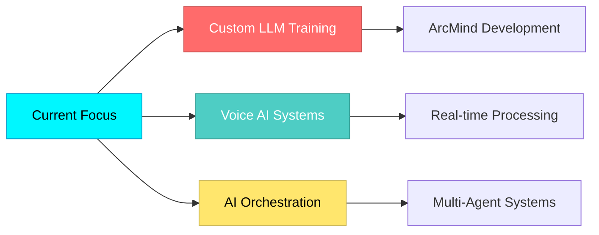

<div align="center">

# 🌌 UTKARSH RISHI

**`AI ARCHITECT • SYSTEM ENGINEER • INTELLIGENCE DESIGNER`**

</div>

```ascii
╔══════════════════════════════════════════════════════════════╗
║  16 y/o Developer Engineering Intelligence From First Principles  ║
║  Building AI That Thinks, Speaks, and Evolves                ║
╚══════════════════════════════════════════════════════════════╝
```

<div align="center">

[](https://git.io/typing-svg)

</div>

---

## ⚡ **THE VISION**

> *"AI shouldn't feel artificial. It should feel **inevitable**."*

I don't use AI. I **architect intelligence**.  
From custom LLMs to voice-first systems, I build AI that's **fast, alive, and deeply personal**.

**Three principles:**
- 🎯 **Speed over bloat** — Intelligence that responds in milliseconds, not minutes
- 🧠 **Memory over amnesia** — Systems that learn, remember, and evolve
- 🔥 **Autonomy over automation** — AI that thinks ahead, not just executes commands

---

## 🛸 **CURRENT BUILDS**

<table>
<tr>
<td width="50%">

### 🦅 **FALCON AI**
**The fastest AI assistant you'll ever use**

- ⚡ Sub-second response times
- 🧠 Context-aware reasoning engine
- 🎯 Built for real-world deployment
- 🔧 Modular, extensible architecture

```python
# Philosophy
speed + intelligence + zero-friction UX
```

</td>
<td width="50%">

### 🧠 **ArcMind LLM**
**Custom intelligence from scratch**

- 🏗️ Training custom transformer models
- 💾 Advanced memory architectures
- 🔄 Self-improving feedback loops
- 🎛️ Full control over model behavior

```python
# Philosophy
autonomy + memory + adaptability
```

</td>
</tr>
<tr>
<td width="50%">

### 🤖 **RishiAI**
**My personal AI consciousness**

- 🖥️ Deep system integration
- 🎙️ Voice-first interaction
- 📊 Real-time data processing
- 🧩 Minimal, elegant, smart

```python
# Philosophy
personal + minimal + system-aware
```

</td>
<td width="50%">

### 🏢 **ArcDevs**
**AI development studio**

- 🚀 Custom AI solutions
- 🔬 Research & experimentation
- 🛠️ Building the infrastructure of AGI
- 🌐 Open-source contributions

```python
# Philosophy
innovation + community + future-first
```

</td>
</tr>
</table>

---

## 🔧 **TECHNOLOGY STACK**

<div align="center">

### **CORE LANGUAGES**


### **AI / ML ECOSYSTEM**


### **SYSTEMS & INFRASTRUCTURE**


</div>

---

## 📊 **STATS & ACTIVITY**

<div align="center">


</div>

---

## 🎯 **WHAT I'M WORKING ON**



**Right now:**
- 🔬 Training custom transformer models with novel architectures
- 🎙️ Building ultra-low-latency voice AI pipelines
- 🧩 Designing multi-agent orchestration systems
- 📚 Publishing research on AI memory and context management

---

## 💭 **PHILOSOPHY**

<div align="center">

| **PRINCIPLE** | **EXECUTION** |
|:-------------:|:-------------:|
| **Build Fast** | Ship iterations in days, not months |
| **Think Deep** | Architecture before implementation |
| **Stay Obsessed** | AI isn't a tool, it's a craft |
| **Go Open** | Share knowledge, elevate the community |

</div>

> I approach AI development like a startup: **fast, obsessed, and future-first**.  
> Every project is a step toward intelligence that doesn't just assist — it **collaborates**.

---

## 🌐 **CONNECT WITH ME**

<div align="center">

[](https://twitter.com/yourhandle)
[](https://linkedin.com/in/yourprofile)
[](https://github.com/yourusername)
[](https://discord.gg/yourserver)
[](mailto:your.email@example.com)

**💬 Let's build the future of intelligence together.**

</div>

---

## 🎨 **FUN FACTS**

- 🧠 I debug AI models the way musicians tune instruments — by **feeling** when something's off
- ⚡ My fastest model response time: **47ms** (still optimizing)
- 🌍 Building from India, shipping globally
- 🎯 2025 Goal: Contribute to open-source AGI research
- 🔥 I measure productivity in models trained, not lines of code written

---

<div align="center">

### ⚡ **"INTELLIGENCE ENGINEERED, NOT ASSEMBLED"**

**If you're building something ambitious in AI, let's connect.**

---


**⭐ Star the repos • 🔱 Fork the future • 🚀 Build something impossible**

---

*Last Updated: January 2026*

</div>
